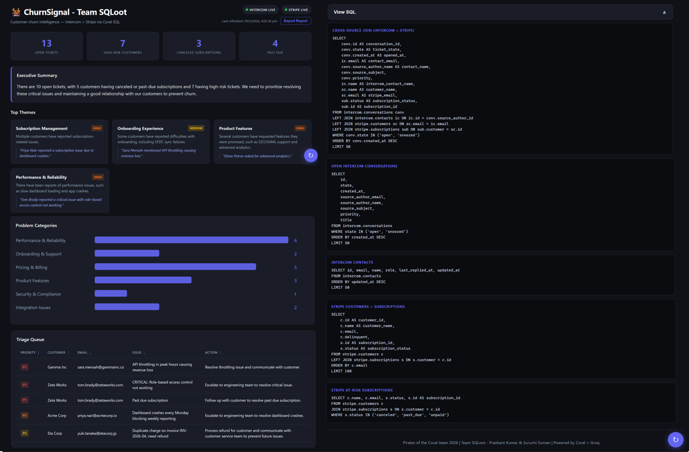

# 🪸 ChurnSignal (SQLoot)

## ChurnSignal — Client Churn Intelligence Agent

ChurnSignal is an enterprise agent that **JOINs live Intercom support data with Stripe billing data via Coral SQL**—no ETL required. Groq (LLaMA 3.3 70B) analyzes combined records to surface churn themes, a prioritized triage queue, risk metrics, and an executive summary. A natural-language **💬 chat interface** lets you ask any question: Groq generates SQL, Coral runs it, and Groq summarizes the answer—all in one dashboard.

**Team SQLoot** — Prashant Kumar & Suruchi Suman  
**Hackathon:** Pirates of the Coral-bean 2026 — Track 1 (Enterprise Agent)

### Features

| # | Capability |
|---|------------|
| 1 | **Cross-source SQL JOIN** — Intercom conversations + Stripe subscriptions via Coral |
| 2 | **Groq LLaMA 3.3 70B analysis** — themes, triage queue, categories, executive summary |
| 3 | **Dark-themed dashboard** — animated metrics, SVG bar chart, sortable triage table |
| 4 | **💬 Natural language chat** — type any question → Groq generates SQL → Coral runs it → Groq summarizes |
| 5 | **Dual data source mode** — `DATA_SOURCE=local` (JSON fixtures) or `DATA_SOURCE=live` (real Coral APIs) |
| 6 | **Export Report**, **Last Refreshed** timestamp, collapsible **SQL viewer** |
| 7 | **Thread-safe Coral execution** — fresh subprocess per query; local chat SQL uses per-request SQLite |

## Demo





**Interactive architecture:** [ui/architecture.html](ui/architecture.html) (or http://127.0.0.1:5000/architecture when the server is running)

## Quickstart

```powershell
copy .env.example .env
# Edit .env — set GROQ_API_KEY (required for AI features)
pip install -r requirements.txt
python src/server.py
```

Open: http://127.0.0.1:5000/

## Run after clone

These files are **not in Git** (see `.gitignore`). You need them locally:

| Item | Required for | What to do |
|------|----------------|------------|
| `.env` | Groq analysis + chat | `copy .env.example .env` and set `GROQ_API_KEY` |
| `data/` folder | `DATA_SOURCE=local` (default) | Create `data/` with demo JSON (see below), **or** set `DATA_SOURCE=live` |
| `coral.exe` | `DATA_SOURCE=live` + Coral health | [Download](https://github.com/withcoral/coral/releases) into project root or set `CORAL_PATH` in `.env` |
| Intercom / Stripe tokens | Live Coral only | Add to `.env` or `coral source add …` |

### Local demo mode (`DATA_SOURCE=local`)

The app expects these files under `data/` (gitignored):

- `intercom_conversations.json`
- `intercom_contacts.json`
- `stripe_customers.json`
- `stripe_subscriptions.json`

Optional for chat SQL: `intercom_companies.json`, `stripe_charges.json`.

If you cloned without `data/`, either:

1. **Use live mode** — set `DATA_SOURCE=live` in `.env`, install `coral.exe`, connect Intercom + Stripe; or  
2. **Add demo fixtures** — copy your own JSON into `data/` (same shape as the app’s local JOIN expects).

Without `data/` and with `DATA_SOURCE=local`, `/api/analysis` will error until fixtures exist.

### Live mode (`DATA_SOURCE=live`)

```powershell
# .env
DATA_SOURCE=live
GROQ_API_KEY=gsk_...
INTERCOM_ACCESS_TOKEN=...
STRIPE_SECRET_KEY=...
```

Place `coral.exe` in the repo root (or set `CORAL_PATH`). For Coral CLI in PowerShell: `. .\scripts\set-env.ps1`

### Optional (not required to run the app)

| File | Purpose |
|------|---------|
| `local.settings.json` | Azure-style secret fallback (copy from `local.settings.example.json`) |
| `.sqloot/mcp.json` (optional) | Local Coral MCP config — point `command` at your `coral.exe` path |
| `test-groq.py`, `test-analysis.py` | Local smoke tests (not shipped in repo) |

## The Problem

- Customer churn costs SaaS companies **5–7× more** than retention
- Churn signals are buried across disconnected tools (support tickets, billing, CRM)
- No single view exists without expensive ETL pipelines

## How Coral Powers It

- **Single SQL query** JOINs Intercom conversations + Stripe subscriptions — no ETL
- Coral runs **100% locally**; data never leaves your machine
- **MCP integration** lets SQLoot query live Intercom + Stripe sources directly
- **Natural language chat** generates and runs Coral SQL on the fly

```sql
SELECT conv.id, conv.state, ic.name, ic.email, sub.status, sub.amount
FROM intercom.conversations conv
LEFT JOIN intercom.contacts ic ON ic.id = conv.source_author_id
LEFT JOIN stripe.customers sc ON sc.email = ic.email
LEFT JOIN stripe.subscriptions sub ON sub.customer = sc.id
WHERE conv.state IN ('open', 'snoozed')
ORDER BY conv.created_at DESC;
```

> **Schema note:** The hackathon guide references `conv.contact__email`; on our Coral schema the correct path is `conv.source_author_id` → `intercom.contacts.email`.

See [`CORAL_QUERIES.sql`](CORAL_QUERIES.sql) for the full query library.

## Architecture

```
┌─────────────────────────────────────────────────────────────┐
│                     DATA SOURCES                            │
│   Intercom API          │          Stripe API               │
│  (conversations,        │     (customers, subscriptions,    │
│   contacts, companies)  │      invoices, charges)           │
└────────────┬────────────┴──────────────┬────────────────────┘
             │                           │
             ▼                           ▼
┌─────────────────────────────────────────────────────────────┐
│                  CORAL SQL ENGINE                           │
│     Cross-source JOINs • Runs locally • No ETL needed      │
│                                                             │
│  SELECT ... FROM intercom.conversations conv                │
│  LEFT JOIN stripe.subscriptions sub ON ...                  │
└──────────────────────────┬──────────────────────────────────┘
                           │
              ┌────────────┴────────────┐
              ▼                         ▼
┌─────────────────────┐    ┌───────────────────────────┐
│   GROQ LLAMA 3.3    │    │     CHAT INTERFACE        │
│                     │    │                           │
│ • Theme analysis    │    │  Natural language query   │
│ • Triage queue      │    │  → Groq generates SQL     │
│ • Categories        │    │  → Coral runs it          │
│ • Exec summary      │    │  → Groq summarizes result │
└──────────┬──────────┘    └─────────────┬─────────────┘
           │                             │
           └──────────────┬──────────────┘
                          ▼
┌─────────────────────────────────────────────────────────────┐
│                 CHURNSIGNAL DASHBOARD                       │
│  Metrics • Themes • Categories Chart • Triage Queue        │
│  Executive Summary • SQL Viewer • 💬 Chat Interface        │
└─────────────────────────────────────────────────────────────┘
```

**Visual version:** [ui/architecture.html](ui/architecture.html)

## Setup

### Step 1: Install Coral

Download `coral.exe` from [github.com/withcoral/coral/releases](https://github.com/withcoral/coral/releases)

```powershell
$env:PATH += ";C:\path\to\coral"
```

Place `coral.exe` in the project root, or set `CORAL_PATH` in `.env`.

### Step 2: Connect sources

```powershell
coral source add intercom   # requires INTERCOM_ACCESS_TOKEN
coral source add stripe     # requires Stripe API key
```

Or load tokens from `.env` via `scripts/set-env.ps1`.

### Step 3: Install Python deps

```powershell
pip install -r requirements.txt
# or: pip install groq flask flask-cors python-dotenv
```

### Step 4: Set environment variables and run

```powershell
copy .env.example .env
# Edit .env: GROQ_API_KEY, DATA_SOURCE=local|live

python src/server.py
```

Or inline:

```powershell
$env:GROQ_API_KEY = "gsk_..."
$env:DATA_SOURCE = "local"     # or "live" for real Coral sources
python src/server.py
```

### Step 5: Open dashboard

- **Recommended:** http://127.0.0.1:5000/ (Flask serves the UI + API on same origin)
- **Static file:** open `ui/index.html` in a browser (API must be reachable at port 5000)

**API endpoints:** `/api/health`, `/api/analysis`, `/api/data`, `/api/chat`, `/api/coral-health`

## Key Coral SQL Queries

### Open Intercom conversations

```sql
SELECT id, state, created_at, source_author_id, source_subject, priority, title
FROM intercom.conversations
WHERE state IN ('open', 'snoozed')
ORDER BY created_at DESC
LIMIT 50;
```

### Stripe at-risk subscriptions

```sql
SELECT c.name, c.email, s.status, s.id AS subscription_id
FROM stripe.customers c
JOIN stripe.subscriptions s ON s.customer = c.id
WHERE s.status IN ('canceled', 'past_due', 'unpaid');
```

### Cross-source JOIN (headline query)

```sql
SELECT
    conv.id AS conversation_id,
    conv.state AS ticket_state,
    ic.email AS contact_email,
    sc.name AS customer_name,
    sub.status AS subscription_status
FROM intercom.conversations conv
LEFT JOIN intercom.contacts ic ON ic.id = conv.source_author_id
LEFT JOIN stripe.customers sc ON sc.email = ic.email
LEFT JOIN stripe.subscriptions sub ON sub.customer = sc.id
WHERE conv.state IN ('open', 'snoozed')
ORDER BY conv.created_at DESC
LIMIT 50;
```

Full set: [`CORAL_QUERIES.sql`](CORAL_QUERIES.sql)

## Dual Data Source Mode

| Mode | Env | Behavior |
|------|-----|----------|
| **Local** | `DATA_SOURCE=local` (default) | Loads rich JSON fixtures from `data/`; JOINs in Python or in-memory SQLite for chat. Ideal for demos, tests, and hackathon judging without live API keys. |
| **Live** | `DATA_SOURCE=live` | Runs real Coral SQL against Intercom + Stripe via `coral.exe`. Falls back to Python merge when JOIN keys are sparse. |

**Why this matters:** Separating data access from analysis logic lets you develop and demo offline with realistic data, switch to production sources with one env var, and keep Groq/Flask/UI unchanged. It is the same pattern teams use for staging vs production—without maintaining two codebases.

## Tech Stack

| Layer | Technology |
|-------|------------|
| Data federation | **Coral 0.4.0** — cross-source SQL query engine |
| AI | **Groq LLaMA 3.3 70B** (fallback: 3.1 8B) — analysis + chat SQL generation |
| Backend | **Flask + Python** — REST API, thread-safe Coral subprocess |
| Frontend | **Vanilla HTML/CSS/JS** — zero-dependency dashboard + architecture page |
| Sources | **Intercom + Stripe** — live data via Coral |

## Project Structure

```
SQLoot/
├── .env.example              # Template — copy to .env
├── coral.exe                 # You install locally (not in Git)
├── src/
│   ├── app.py                # Coral queries, Groq analysis, chat (ask_question)
│   └── server.py             # Flask API + dashboard routes
├── ui/
│   ├── index.html            # Dashboard
│   └── architecture.html     # Architecture visualization
├── scripts/set-env.ps1       # Load .env for coral.exe CLI
├── data/                     # Local demo JSON (gitignored — you create)
├── docs/                     # Screenshots (e.g. demo-screenshot.png)
├── CORAL_QUERIES.sql
└── requirements.txt
```

## Hackathon Submission

- Form: https://forms.gle/iLRYXPsGHFTj7xaeA
- Discord: Coral #show-and-tell
- Social: LinkedIn/X tagging @withcoral

---

Built for: **Pirates of the Coral-bean Hackathon 2026** | Track 1: Enterprise Agent  
*Team SQLoot — Powered by Coral + Groq*
